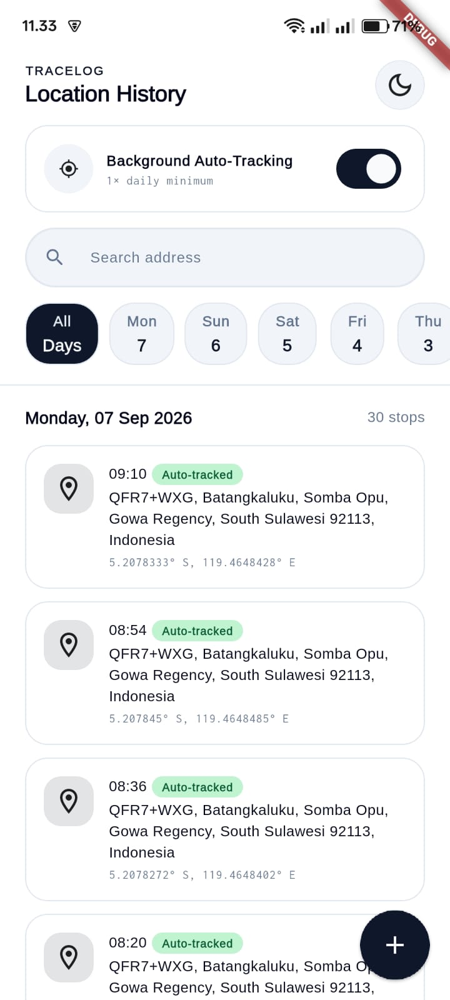
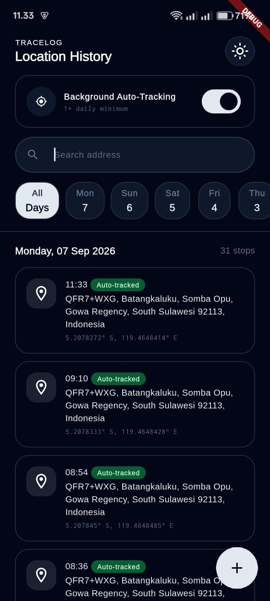
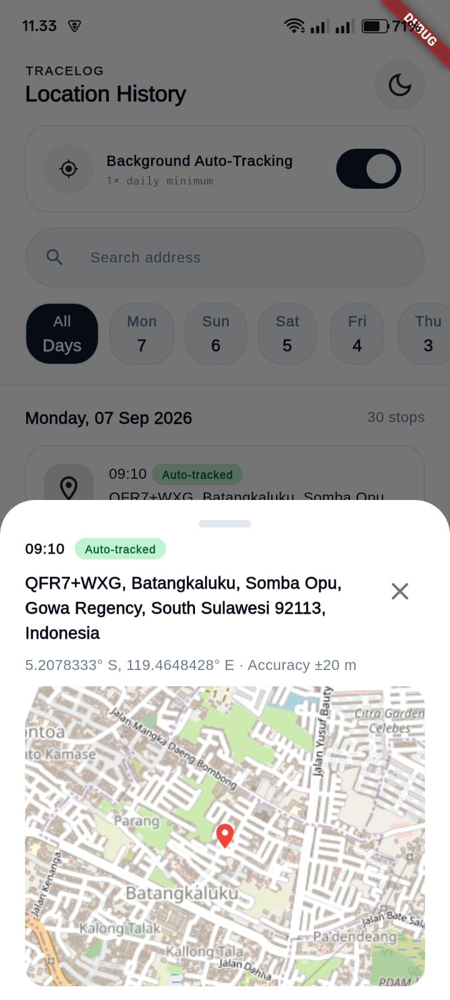
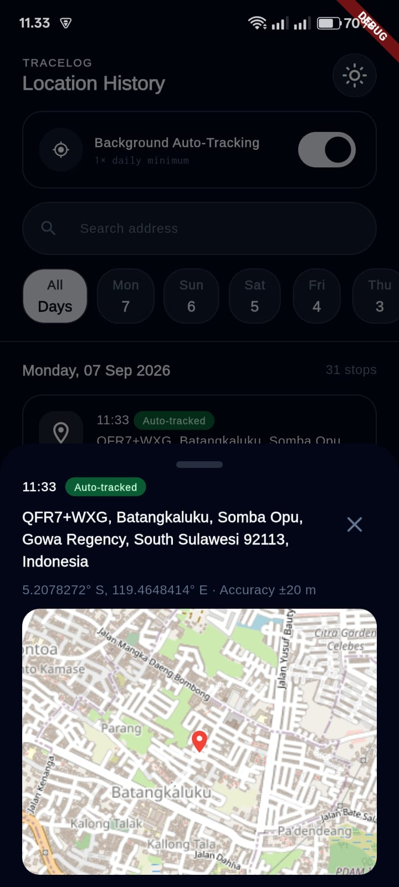

# TraceLog 📍

[](https://github.com/pakdhel/tracelog-app/actions/workflows/ci.yml)

TraceLog adalah aplikasi mobile location history & auto-tracker yang dibangun menggunakan Flutter. Project ini dibuat sebagai media belajar sekaligus portofolio, dengan fokus pada penerapan praktik pengembangan Flutter modern — mulai dari state management, local persistence, background execution di Android, hingga desain sistem tema terpusat.

> ✅ **Status:** Pencatatan lokasi manual & otomatis (background service), local storage (sqflite), auto-tracking toggle, preview peta, dark/light theme, search & filter lokasi, hapus entry, automated testing (unit, widget, database, provider), serta CI dengan GitHub Actions sudah berfungsi penuh. Selanjutnya: dukungan iOS untuk background execution.

## ✨ Tentang Project

TraceLog dibangun bukan sekadar untuk menghasilkan aplikasi yang jadi, tapi untuk memperdalam pemahaman terhadap konsep-konsep berikut secara langsung lewat praktik:

- State management dengan **Riverpod** (`AsyncNotifier`, `AsyncValue.guard()`, `ref.listen()`)
- Background execution di Android dengan **WorkManager**, termasuk komunikasi lintas-isolate
- Local persistence dengan **sqflite** sebagai single source of truth
- Exception handling terstruktur dengan **sealed class**
- Design system yang terstruktur (colors, typography, theming terpusat, light & dark)
- Integrasi peta interaktif dengan **flutter_map** (OpenStreetMap)
- Automated testing di berbagai lapisan (unit, widget, database, provider) dengan fake service dan in-memory database
- Continuous Integration dengan **GitHub Actions**

## 🛠️ Tech Stack

- **Flutter** — framework utama
- **Riverpod** — state management (`AsyncNotifier`, `AsyncValue`)
- **geolocator** & **geocoding** — akses lokasi device & reverse geocoding
- **workmanager** — penjadwalan background task (auto-tracking)
- **sqflite** (+ `sqflite_common_ffi` untuk testing) — database lokal untuk riwayat lokasi
- **shared_preferences** — penyimpanan pengaturan tema & auto-tracking
- **flutter_map** + **latlong2** — preview peta interaktif (OpenStreetMap)
- **google_fonts** — font Arimo & Inconsolata
- **GitHub Actions** — CI, menjalankan seluruh test otomatis di setiap push/PR

## 🎨 Desain

### Design System

Warna, tipografi, dan komponen tema disusun terpusat agar konsisten di seluruh aplikasi, termasuk dukungan penuh light & dark mode:

```
lib/style/
├── colors/
│   ├── tracelog_colors.dart       # Palet warna mode terang
│   └── tracelog_dark_colors.dart  # Palet warna mode gelap
├── typography/
│   └── tracelog_textstyles.dart   # Text styles (Arimo & Inconsolata)
└── theme/
    └── tracelog_theme.dart        # ThemeData terpusat (light & dark)
```

## 📱 Screenshots

| Home (Light) | Home (Dark) | Location Detail (Light) | Location Detail (Dark) |
|---|---|---|---|
|  |  |  |  |

## 📂 Struktur Project

```
lib/
├── api/                          # GeolocatorService, GeocodingService, DatabaseService, SharedPreferencesService
├── models/
│   └── location_entry.dart       # LocationEntry (+ toJson/fromJson untuk sqflite)
├── providers/                    # ListLocationNotifier, AutoTrackNotifier, ThemeNotifier, DateFilterNotifier
├── screens/
│   ├── home_screen.dart
│   └── widgets/                  # ListtileLocationWidget, LocationDetailSheet, MapPreviewWidget, dll.
├── static/
│   └── location_exception.dart   # sealed class LocationException
├── style/                        # Design system (colors, typography, theme)
├── utils/
│   └── coordinates_convertion.dart
├── background_service.dart       # callbackDispatcher untuk WorkManager
└── main.dart

test/
├── api/                          # DatabaseService (in-memory, sqflite_common_ffi)
├── models/                       # LocationEntry serialization
├── providers/                    # DateFilterNotifier, ListLocationNotifier (fake services)
├── screens/                      # HomeScreen, ListtileLocationWidget, LabelWidget
└── utils/                        # DateHelper, CoordinatesConvertion

.github/workflows/
└── ci.yml                        # GitHub Actions — flutter pub get + flutter test
```

## 🚀 Roadmap

**UI / Design System**
- [x] Setup design system (colors, typography, theme — light & dark)
- [x] Halaman Home dengan grouping lokasi per tanggal
- [x] Location Detail Sheet dengan preview peta interaktif

**Lokasi & Arsitektur**
- [x] Pencatatan lokasi manual via FAB, dengan reverse geocoding
- [x] Exception handling terstruktur (`sealed class LocationException`) untuk kasus GPS mati, permission ditolak, dan permission ditolak permanen
- [x] Local database (sqflite) sebagai single source of truth untuk riwayat lokasi
- [x] Background auto-tracking dengan WorkManager (teruji berjalan bahkan saat aplikasi di-*kill*)
- [x] Integrasi Riverpod (`AsyncNotifier`, `AsyncValue.guard()`) untuk seluruh state
- [x] Auto-refresh UI saat aplikasi kembali ke foreground (`AppLifecycleListener`)
- [x] Dark/light/system theme, tersimpan otomatis
- [x] Search lokasi berdasarkan alamat (real-time, case-insensitive) dan filter chip 7 hari terakhir, keduanya bisa dikombinasikan
- [x] Hapus entry lokasi

**Quality & Tooling**
- [x] Unit test (util functions, model serialization)
- [x] Widget test (dengan `ProviderScope` untuk widget yang terhubung Riverpod)
- [x] Database test dengan `sqflite_common_ffi` (in-memory, terisolasi per test)
- [x] Provider/notifier test dengan `ProviderContainer`, `overrides`, dan fake service (geolocator & geocoding)
- [x] CI dengan GitHub Actions — seluruh test dijalankan otomatis di setiap push/PR ke `main`
- [ ] Dukungan iOS untuk background execution

## ⚠️ Known Limitations

Project ini masih tahap belajar, bukan rilis produksi yang siap dipublikasikan. Beberapa keterbatasan yang sudah teridentifikasi:

- **Frequency background task masih nilai testing** — perlu diubah ke interval 24 jam sebelum dipakai di kondisi nyata, saat ini masih diset pendek untuk mempercepat pengujian.
- **Dependency `workmanager` dari branch `main` git**, bukan rilis stabil di pub.dev — perlu dipantau untuk breaking change, karena belum ada rilis resmi yang mencakup fix yang dibutuhkan saat project ini dibuat.
- **Android only** — setup background execution untuk iOS belum dikonfigurasi maupun diuji.
- **Belum ada CD (Continuous Deployment)** — CI baru menjalankan test; build & distribusi APK otomatis belum disiapkan.

## 🏃 Cara Menjalankan Project

```bash
git clone https://github.com/pakdhel/tracelog-app.git
cd tracelog-app
flutter pub get
flutter run
```

Izin lokasi dan pengecualian battery-optimization perlu diberikan manual di device agar background tracking berjalan andal — lihat `AndroidManifest.xml` untuk daftar permission yang dideklarasikan.

### Menjalankan test

```bash
flutter test
```

## 👤 Author

**Fadhel Hayat**
- Portfolio: [fadhelhayat.vercel.app](https://fadhelhayat.vercel.app/)
- GitHub: [@pakdhel](https://github.com/pakdhel)